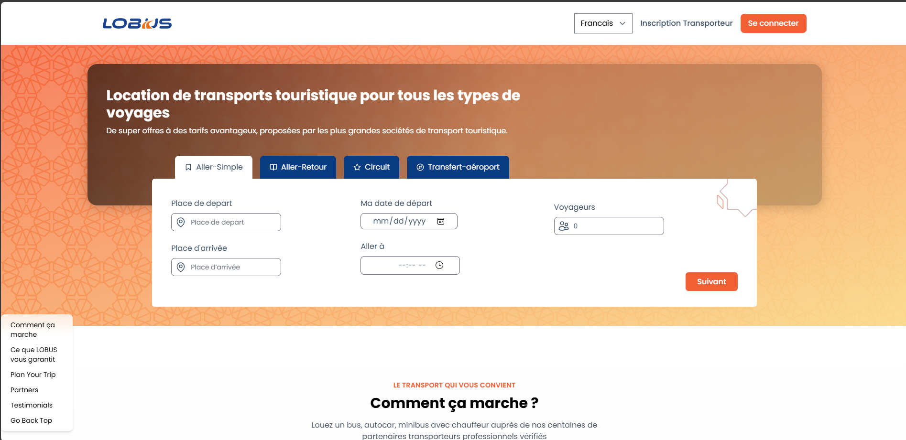

# Lobus

## Overview

This project is a web application designed to facilitate travel planning and booking services. It provides users with a modern interface to navigate through various features, including trip planning, testimonials, and service guarantees.



## Features

- **User Authentication**: Users can register and log in to access personalized features.
- **Navigation Helper**: A sticky navigation bar that helps users quickly access different sections of the application.
- **Steps Header**: A visual representation of the steps involved in the booking process.
- **Responsive Design**: The application is designed to be fully responsive, providing a seamless experience on both desktop and mobile devices.
- **Multilingual Support**: Users can switch between different languages (e.g., French and English).
- **Dynamic Content**: The application fetches and displays dynamic content based on user interactions.

## User Flow

1. **Landing Page**: Users are greeted with a hero section that introduces the application and its services.
2. **Navigation**: Users can navigate through various sections using the sticky navigation bar.
3. **Steps to Plan a Trip**: Users can view the steps involved in planning their trip, which are visually represented in a step-by-step format.
4. **Service Selection**: Users can select different services (e.g., transfers, tours) and view detailed information about each.
5. **User Registration/Login**: Users can create an account or log in to access personalized features.
6. **Booking Process**: Users can follow the guided steps to complete their booking.

## Getting Started

To run the project locally, follow these steps:

### Prerequisites

- Node.js (version 14 or higher)
- npm (Node Package Manager)

### Installation

1. **Clone the repository**:
   ```bash
   git clone repolink
   cd lobus
   ```

2. **Install dependencies**:
   ```bash
   npm install
   ```

3. **Run the development server**:
   ```bash
   npm run serve
   ```

4. **Open your browser** and navigate to `http://localhost:5173` (or the port specified in the terminal).

### Build for Production

To build the application for production, run:
